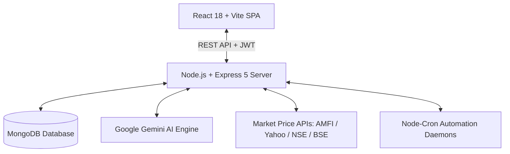

# 💎 Capise — Autonomous Personal Finance & Wealth Operating System

> **An intelligent, autonomous personal finance platform powered by Google Gemini AI, real-time market revaluation engines, and proactive financial intelligence.**  
> Effortlessly track multi-asset portfolios, bank accounts, budgets, goals, liabilities, and recurring bills — with deterministic simulation engines and autonomous financial guardrails.

---

## 📑 Table of Contents

- [Executive Overview](#-executive-overview)
- [System Architecture & Tech Stack](#-system-architecture--tech-stack)
- [Comprehensive Feature Breakdown](#-comprehensive-feature-breakdown)
  - [1. Executive Financial Dashboard](#1-executive-financial-dashboard)
  - [2. Multi-Account Central Hub](#2-multi-account-central-hub)
  - [3. Autonomous Transactions Ledger](#3-autonomous-transactions-ledger)
  - [4. Multi-Asset Investments & Market Revaluation](#4-multi-asset-investments--market-revaluation)
  - [5. Smart Budgets & Real-Time Guardrails](#5-smart-budgets--real-time-guardrails)
  - [6. Goals & Milestones Tracker](#6-goals--milestones-tracker)
  - [7. Loans & Debt Payoff Accelerator](#7-loans--debt-payoff-accelerator)
  - [8. Peer-to-Peer Lending & Split Management (People)](#8-peer-to-peer-lending--split-management-people)
  - [9. Bills, Subscriptions & Zombie Service Audit](#9-bills-subscriptions--zombie-service-audit)
  - [10. Proactive Financial Intelligence Hub](#10-proactive-financial-intelligence-hub)
    - [Proactive Intelligence Nudges](#proactive-intelligence-nudges)
    - [Overdraft Shield](#overdraft-shield)
    - [Salary Day Smart Distributor](#salary-day-smart-distributor)
    - [What-If Financial Time Machine](#what-if-financial-time-machine)
    - [AI Financial Copilot & Autonomous Action Drawer](#ai-financial-copilot--autonomous-action-drawer)
  - [11. Net Worth & Asset Solvency Analytics](#11-net-worth--asset-solvency-analytics)
  - [12. Tax Planning & Regime Comparator](#12-tax-planning--regime-comparator)
  - [13. Unified Financial Calendar](#13-unified-financial-calendar)
  - [14. Deep Analytics & Cashflow Reports](#14-deep-analytics--cashflow-reports)
  - [15. Categories & Taxonomy System](#15-categories--taxonomy-system)
- [Autonomous Background Daemons (Cron Master)](#-autonomous-background-daemons-cron-master)
- [Database Models & Entity Architecture](#-database-models--entity-architecture)
- [API Reference & Endpoint Map](#-api-reference--endpoint-map)
- [Installation & Local Setup](#-installation--local-setup)
- [Environment Variables Configuration](#-environment-variables-configuration)
- [Security & Architecture Standards](#-security--architecture-standards)

---

## 🌟 Executive Overview

Managing modern personal finances across checking accounts, credit cards, mutual funds, direct stocks, gold, employee provident funds, personal loans, and recurring subscriptions is fragmented, exhausting, and manual.

**Capise** transforms personal finance from a passive spreadsheet into an **autonomous financial copilot**. It:
1. **Unifies your complete net worth** in one real-time dashboard across liquid cash, investments, and debts.
2. **Auto-revalues your assets** using live market data (NSE/BSE Indian stocks via ISIN codes, AMFI Mutual Fund NAVs, Yahoo Finance tickers, and global crypto).
3. **Automates capital deployment** by logging recurring SIPs, salary day distributions, and goal savings as proper non-expense transfers.
4. **Protects your bank balances** via an intelligent **Overdraft Shield** that detects impending minimum balance violations and calculates zero-cost internal rebalancing transfers.
5. **Projects your financial destiny** with the **What-If Financial Time Machine**, simulating career moves, home purchases, sabbatical years, and market shocks 10 to 30 years into the future with database-grounded calculations.
6. **Empowers you with an AI Copilot** that doesn't just give generic advice — it understands your exact financial ground truth and executes 1-click financial actions directly on your accounts.

---

## 🏗️ System Architecture & Tech Stack



### Frontend (`/Client`)
- **Core**: React 18 (Single Page Application via React Router v6)
- **Bundler & Build**: Vite 8 with ESBuild/Rolldown runtime optimization
- **State Management**: Redux Toolkit (`@reduxjs/toolkit`, `react-redux`) for predictive global state and slice-based API handling
- **Styling**: Modern Tailwind CSS design system with custom glassmorphism, responsive cards, rich badges, and mobile-first layouts
- **Icons & Visuals**: Lucide React (`lucide-react`) & Canvas Confetti for goal celebrations
- **Formatting Utilities**: Internationalized Indian Rupee (`₹`, `en-IN`) and multi-currency formatter (`formatCurrency.js`)

### Backend (`/Server`)
- **Runtime**: Node.js v22 (ECMAScript ESM modules)
- **Framework**: Express 5 with JSON payload support up to **`50MB`** for rich statements and image attachments
- **Database**: MongoDB with Mongoose ODM (indexes on `user`, `date`, `category`, `isActive`)
- **Artificial Intelligence**: Google Gemini API (`@google/genai`) with an autonomous multi-model fallback chain (`gemini-2.5-flash` ➡️ `gemini-3.5-flash-lite`)
- **Cache Engine**: High-frequency in-memory TTL cache (`MemoryCache`) for proactive nudges, overdraft checks, and simulation states
- **Automation**: Node-Cron (`node-cron`) for scheduled midnight executions, market revaluations, and 1st-of-month review digests
- **Authentication**: Stateless JWT tokens stored in HTTP headers with bcrypt password encryption

---

## 🚀 Comprehensive Feature Breakdown

### 1. Executive Financial Dashboard
- **Real-Time Wealth Metrics**: Instant view of **Total Net Worth**, **Total Liquid Balance**, **Total Invested Capital**, and **Total Outstanding Debt**.
- **Cashflow Momentum**: Current month's total Income vs Total Expenses with dynamic net savings rate (`%`) gauge.
- **Budget Depletion Guardrails**: Compact visual progress bars showing category budget consumption.
- **Commitments & Debt Timeline**: Upcoming scheduled bills, subscription renewals, and loan EMIs due in the next 14 days.
- **Interactive Quick Launcher**: 1-click modal access to:
  - 💸 **Add Transaction**
  - 📸 **Scan Receipt with AI**
  - 📥 **Import Bank Statement CSV**
  - 🛡️ **Launch Overdraft Shield**
  - 💼 **Salary Day Smart Distributor**
  - ⏳ **What-If Financial Time Machine**

---

### 2. Multi-Account Central Hub
- **Support for All Account Types**:
  - 🏦 **Bank Accounts** (Checking, Salary, Savings)
  - 💳 **Credit Cards** (Tracks current balance, credit limit, and available credit)
  - 💵 **Cash in Hand** (Petty cash and physical wallet balances)
  - 📱 **Digital Wallets** (Paytm, PhonePe, Amazon Pay, UPI balance)
  - 📈 **Investment / Demat Accounts** (Zerodha, Groww, AngelOne)
- **Credit Health & Utilization**: Real-time calculation of credit utilization percentage with alert badges when crossing the recommended 30% threshold.
- **Account Archiving & Balance Reconciliation**: Safely archive closed accounts without losing historical transactions, or adjust balances with instant audit tracking.

---

### 3. Autonomous Transactions Ledger
- **Multi-Vector Filter Engine**:
  - Filter by **Type** (`All`, `Expense`, `Income`, `Transfer`).
  - Filter by **Account** (source and destination matching).
  - Filter by **Category** and Subcategory.
  - Filter by **Date Range** (`Start Date` to `End Date`).
  - Filter by **Amount Range** (`Min Amount` to `Max Amount`).
  - Real-time instant search matching across **merchant**, **notes**, **category name**, **account name**, **type**, and **tags** (`t.tags`).
- **Transfer Intelligence**: Automatically distinguishes capital movements:
  - `💼 Investment`: Capital deployed from bank into investments.
  - `🎯 Goal Savings`: Money moved into designated emergency funds and goals.
  - `🔁 Transfer`: Rebalancing between checking, savings, and digital wallets.
- **AI Receipt Scanner (Multimodal OCR)**:
  - Upload receipt or invoice photos (`PNG`, `JPEG`, `WebP`).
  - Uses Google Gemini vision to extract merchant name, transaction date, total amount, taxes, category recommendation, and line-item breakdown.
- **Intelligent Bank Statement CSV Importer**:
  - Drag-and-drop any bank CSV statement (HDFC, ICICI, SBI, Axis, Kotak, etc.).
  - Auto-detects columns: Date, Description / Narration, Debit, Credit, Balance, Reference Number.
  - **Deduplication Engine**: Automatically identifies already-ingested transactions using date-merchant-amount hashing to prevent double-counting.
- **Real-Time Budget Guardrail Alarms**: Displays immediate warning and critical banners when adding a transaction that pushes category spending over 85% or 100% of its budget cap.

---

### 4. Multi-Asset Investments & Market Revaluation

Capise provides an end-to-end investment management hub designed specifically for both Indian and global assets:

#### Supported Asset Classes
- 📈 **Direct Stocks** (NSE / BSE Indian equities via ISIN codes or tickers)
- 📊 **Mutual Funds** (Direct & Regular schemes via 6-digit AMFI codes or ISINs)
- 🪙 **Exchange Traded Funds (ETFs)** (Nifty 50, Bank Nifty, Gold BeES, Silver BeES)
- 🏅 **Gold & Silver** (Sovereign Gold Bonds, Physical 24K/22K Gold, Digital Gold, Silver)
- 🌐 **Cryptocurrencies** (Bitcoin, Ethereum, Solana via live market APIs)
- 🔒 **Fixed Deposits & Term Deposits** (SBI, HDFC, ICICI with interest tracking & maturity dates)
- 🏛️ **Government Backed Schemes** (PPF 15-Year, EPF / EPFO Passbook, NPS Tier-1 & Tier-2)
- 📜 **Corporate & Government Bonds** (Yield tracking, maturity dates, interest payout schedules)

#### Key Capabilities
- **Automated Live Market Revaluation Engine**:
  - Enter an ISIN code (e.g., `INE002A01018` for Reliance Industries, `INE009A01021` for Infosys) or AMFI Scheme Code (e.g., `120503` for Axis Long Term Equity).
  - Automatically resolves ISINs to live exchange tickers (`.NS` / `.BO`) and fetches latest market prices.
  - Built-in "Test / Verify Code" button with live status feedback.
  - "Sync All Prices" button triggers bulk revaluation across your entire portfolio.
- **Asset Code Guide Modal**:
  - Interactive cheat sheet embedded right inside the modal with verified examples for ISIN codes, AMFI codes, Yahoo Finance tickers, commodities, and crypto.
- **Automated Recurring SIP Processor**:
  - Configure automated SIPs with frequency (`Monthly`, `Weekly`, `Quarterly`), debit day, and linked funding bank account.
  - Background cron daemon automatically executes scheduled installments, deducts bank account balances, records `Transfer` transactions, and updates investment units.
- **Manual Investment Addition with Automatic Ledger Booking**:
  - When manually adding a lump sum investment, Capise provides a dedicated **"💸 Record as Transfer in Transactions Tab"** toggle.
  - Automatically books a `Transfer` transaction (`tags: ['investment', 'transfer']`), links the source account, and debits the balance to ensure the transaction ledger matches reality.
- **Profit / Loss & Performance Metrics**:
  - Real-time absolute gain/loss (`₹`) and percentage return (`%`).
  - Historical value trend charts for every asset.

---

### 5. Smart Budgets & Real-Time Guardrails
- **Flexible Budgeting**: Set category budgets for monthly or custom rolling periods.
- **Three-Tier Depletion Engine**:
  - 🟢 **Healthy** (< 75% consumed): Normal pacing.
  - 🟡 **Caution** (75% – 90% consumed): Advisory alert banners.
  - 🔴 **Critical Breach** (> 90% – 100%+ consumed): Urgent budget guardrail notification.
- **Visual Budget Cards**: Shows spent amount, remaining allowance, daily burn velocity, and projected month-end overage.

---

### 6. Goals & Milestones Tracker
- **Custom Milestone Targets**: Create goals for Emergency Funds, Home Down Payments, Vacations, Vehicle Purchases, or Retirement.
- **Pacing Intelligence**: Calculates the exact monthly savings required to hit target dates based on days remaining.
- **1-Click Goal Contributions**:
  - Deposit money into any goal directly from any bank account.
  - Automatically logged as a `Transfer` (not an expense) with `tags: ['goal', 'contribution']`.
- **Celebration Confetti**: Visual celebration animation when a goal hits 100% completion.

---

### 7. Loans & Debt Payoff Accelerator
- **Liability Tracking**: Personal Loans, Home Mortgages, Auto Loans, Education Loans, and Credit Card installment plans.
- **Detailed Loan Analytics**:
  - Principal amount, annual interest rate (`%`), loan tenure, and start date.
  - Exact monthly EMI calculation and total interest payable.
  - Visual principal vs interest amortization breakdown.
- **Prepayment & Early Payoff Simulator**:
  - Calculates interest saved and tenure reduction when making lump sum or recurring extra prepayments.
- **Auto-Debit Loan EMIs**: Midnight cron job automatically posts EMI payments on the designated due day.

---

### 8. Peer-to-Peer Lending & Split Management (People)
- **Track Monies Lent & Borrowed**: Never forget who owes you money or who you need to repay.
- **Person Profiles**: View net balance per person across all historical transactions.
- **Repayment Logging**: Record partial or full repayments with automated bank account balance updates and transfer records.
- **Reminders**: Track settlement due dates and overdue statuses.

---

### 9. Bills, Subscriptions & Zombie Service Audit
- **Recurring Bill Tracker**: Electricity, broadband, rent, credit card bills, insurance premiums, and mobile recharges.
- **Due Date Alerts**: Color-coded badges for bills due today, due this week, or overdue.
- **Zombie Subscription Detector**:
  - Analyzes transaction histories to detect recurring payments (Netflix, Spotify, AWS, Gym, SaaS).
  - Flags duplicate services, unused subscriptions, and price creep over time.
  - Calculates total annual subscription cost and highlights immediate cancellation savings.

---

### 10. Proactive Financial Intelligence Hub

Located at `/intelligence`, this is the command center for autonomous financial management:

#### Proactive Intelligence Nudges
- **Continuous 8-Point Surveillance Engine**:
  1. **High Credit Utilization**: Warns when card utilization exceeds 30%.
  2. **Emergency Fund Vulnerability**: Alerts if liquid cash covers less than 3 months of mandatory expenses.
  3. **Overspending Pace**: Flags categories burning budget faster than the calendar progression.
  4. **Bill Due Proximity**: Alerts for bills due in the next 48 hours.
  5. **Low Balance Alert**: Warns when checking accounts approach minimum balance limits.
  6. **SIP Cash Readiness**: Verifies sufficient bank balance before automated SIP dates.
  7. **Debt-to-Income Risk**: Detects dangerous leverage ratios.
  8. **Tax Deduction Deficit**: Recommends 80C/80D investments before financial year-end.

#### Overdraft Shield
- Continuously inspects checking/salary accounts against minimum balance thresholds (e.g., ₹10,000).
- Calculates projected minimum balances over the next 14 days by factoring in scheduled bills and SIPs.
- If a shortfall is detected, it automatically drafts a **Zero-Cost Internal Rebalancing Plan**, proposing exact transfers from high-liquidity savings/FD accounts to prevent penalty charges.
- 1-click execution executes the proposed rebalancing transfer instantly.

#### Salary Day Smart Distributor
- Solves the payday dilemma using either the **50/30/20 Rule** or **Custom Rules**:
  - **Needs (50%)**: Rent, bills, loan EMIs, and essential groceries.
  - **Savings & Goals (20%)**: Emergency fund and goal top-ups.
  - **Investments**: Automated allocation into mutual funds, stocks, and retirement.
  - **Discretionary (30%)**: Lifestyle, shopping, and dining.
- Generates a clear distribution blueprint on salary day.
- 1-click execution moves the funds into designated accounts and goals as transfers.

#### What-If Financial Time Machine
- **Deterministic Compound Projection Engine**:
  - Simulates scenarios such as:
    - *"What if I buy a home with a ₹20,00,000 down payment and ₹45,000 EMI?"*
    - *"What if I take a 6-month unpaid sabbatical?"*
    - *"What if I switch jobs with a 35% pay hike?"*
    - *"What if inflation rises to 8% and the equity market corrects 20%?"*
  - Projects net worth year-by-year over **5, 10, 15, 20, 25, or 30 years**.
  - Graphs **Baseline Trajectory vs Scenario Trajectory** side-by-side.
- **Gemini AI Grounding**: Analyzes the mathematical projection and delivers actionable strategic commentary, risk assessments, and milestone impacts.

#### AI Financial Copilot & Autonomous Action Drawer
- Accessible from any screen via the floating AI button or header drawer.
- **Ground-Truth Data Assembly**: Prior to calling Gemini, the server precomputes the user's active ground-truth figures:
  - Exact net worth, active liquid balances, total debts, and active investment holdings (filtered strictly by `isActive: true`).
- **Autonomous Tool Calling (Copilot Actions)**: The AI Copilot can propose and execute real actions with your permission:
  - `CONTRIBUTE_TO_GOAL`: Transfers money into an emergency fund or goal.
  - `RECORD_TRANSACTION`: Logs income, expense, or transfer transactions.
  - `DEPLOY_INVESTMENT`: Records a capital deployment into an investment holding.
- **Rich Markdown Formatting**: Renders responsive tables, hierarchical headings, bullet & numbered lists, monospace code blocks, and styled badges.
- **Multi-Model Fallback Chain**: Tries `gemini-2.5-flash` first, and if rate-limited or busy, gracefully falls back to `gemini-3.5-flash-lite` with automatic retries.

---

### 11. Net Worth & Asset Solvency Analytics
- **Historical Net Worth Trajectory**: Tracks total net worth over time through autonomous 1st-of-the-month snapshots.
- **Asset Allocation Sunburst / Pie Charts**: Distribution across Equities, Fixed Income, Cash, Precious Metals, and Real Assets.
- **Financial Solvency Ratios**:
  - **Solvency Index**: Ratio of total assets to total liabilities.
  - **Liquidity Runway**: Number of months the household can survive on liquid reserves alone.
  - **Debt-to-Asset Ratio**: Overall financial leverage health.

---

### 12. Tax Planning & Regime Comparator
- **Indian Income Tax Assessment (Old vs New Regime)**:
  - Compares tax liabilities under the New Tax Regime (Section 115BAC) and the Old Tax Regime.
- **Deduction & Exemption Breakdown**:
  - Section 80C (PPF, ELSS, EPF, LIC — up to ₹1,50,000).
  - Section 80D (Health Insurance premiums).
  - Section 80CCD(1B) (National Pension System — additional ₹50,000).
  - Section 24(b) (Home Loan Interest deduction — up to ₹2,00,000).
  - House Rent Allowance (HRA) exemption calculator.
- Recommends which regime yields lower tax liability based on user's specific investment and expense profile.

---

### 13. Unified Financial Calendar
- **Full Monthly Calendar View**:
  - Combines salary paydays, bill due dates, scheduled SIP installments, loan EMI debits, and goal deadlines.
  - Color-coded badges for easy visual distinction.
  - Click on any day to see the exact cash inflows and outflows scheduled.

---

### 14. Deep Analytics & Cashflow Reports
- **Spending Heatmaps**: Identify peak spending days and seasonal spikes.
- **Category & Subcategory Breakdown**: Detailed donuts and bar charts.
- **Merchant Distribution**: See top merchants by total expenditure.
- **Export Engine**: Export filtered ledger reports in CSV format.

---

### 15. Categories & Taxonomy System
- Preloaded with comprehensive personal finance categories (Housing, Utilities, Groceries, Dining, Health, Subscriptions, Salary, Investments, etc.).
- Create custom parent categories and nested subcategories.
- Assign custom colors and icons for instant visual recognition.

---

## ⏰ Autonomous Background Daemons (Cron Master)

Configured in [`Server/cron/index.js`](file:///Users/harshalpatil/Desktop/Projects/Personal%20Finance/Server/cron/index.js):

| Schedule | Daemon | Purpose |
|---|---|---|
| `0 0 * * *` (Daily Midnight) | **Midnight Financial Automation** | Auto-posts recurring bills, auto-debits loan EMIs, executes scheduled SIPs, and runs Proactive Guardian. |
| `0 */6 * * *` (Every 6 Hours) | **Proactive Intelligence Guardian** | Evaluates 8 financial health checks and updates real-time nudges. |
| `0 16 * * 1-5` (Daily 4 PM Mon-Fri) | **Market Close Portfolio Revaluation** | Fetches latest market closing prices for stocks, ETFs, and AMFI mutual funds. |
| `5 0 1 * *` (Monthly 1st 00:05 AM) | **Monthly Net Worth & Digest** | Captures net worth snapshots and synthesizes monthly review digests. |

---

## 🗄️ Database Models & Entity Architecture

Located in [`Server/models/`](file:///Users/harshalpatil/Desktop/Projects/Personal%20Finance/Server/models/):

- [`User.js`](file:///Users/harshalpatil/Desktop/Projects/Personal%20Finance/Server/models/User.js): Authentication credentials, currency preference, salary day, and profile settings.
- [`Account.js`](file:///Users/harshalpatil/Desktop/Projects/Personal%20Finance/Server/models/Account.js): Bank, credit card, cash, wallet, and investment accounts with balances and credit limits.
- [`Transaction.js`](file:///Users/harshalpatil/Desktop/Projects/Personal%20Finance/Server/models/Transaction.js): Ledger entries (`Income`, `Expense`, `Transfer`), accounts, categories, tags, attachment URLs.
- [`Investment.js`](file:///Users/harshalpatil/Desktop/Projects/Personal%20Finance/Server/models/Investment.js): Multi-asset holdings, ISINs, AMFI scheme codes, SIP configs, funding account, transaction links, value history.
- [`Budget.js`](file:///Users/harshalpatil/Desktop/Projects/Personal%20Finance/Server/models/Budget.js): Category spending limits, periods, and notification thresholds.
- [`Goal.js`](file:///Users/harshalpatil/Desktop/Projects/Personal%20Finance/Server/models/Goal.js): Target amounts, target dates, priorities, contributions array with linked transaction IDs.
- [`Loan.js`](file:///Users/harshalpatil/Desktop/Projects/Personal%20Finance/Server/models/Loan.js): Liabilities, principal, interest rate, tenure, EMI schedules, and payoff history.
- [`Lending.js`](file:///Users/harshalpatil/Desktop/Projects/Personal%20Finance/Server/models/Lending.js): Peer-to-peer debts (lent or borrowed), debtor/creditor info, and repayment logs.
- [`RecurringRule.js`](file:///Users/harshalpatil/Desktop/Projects/Personal%20Finance/Server/models/RecurringRule.js): Bills and recurring transaction definitions with frequencies and auto-post settings.
- [`SalaryDistributionPlan.js`](file:///Users/harshalpatil/Desktop/Projects/Personal%20Finance/Server/models/SalaryDistributionPlan.js): Payday distribution rules (Needs, Goals, Investments, Discretionary).
- [`NetWorthSnapshot.js`](file:///Users/harshalpatil/Desktop/Projects/Personal%20Finance/Server/models/NetWorthSnapshot.js): Monthly snapshots of total assets, liabilities, and net worth.
- [`ProactiveNudge.js`](file:///Users/harshalpatil/Desktop/Projects/Personal%20Finance/Server/models/ProactiveNudge.js): System-generated actionable alerts with dismiss and snooze states.
- [`TaxRecord.js`](file:///Users/harshalpatil/Desktop/Projects/Personal%20Finance/Server/models/TaxRecord.js): Annual tax profiles, deductions under 80C/80D/80CCD, and regime calculations.
- [`MonthlyReviewDigest.js`](file:///Users/harshalpatil/Desktop/Projects/Personal%20Finance/Server/models/MonthlyReviewDigest.js): AI-generated monthly financial retrospectives.

---

## 🔌 API Reference & Endpoint Map

All routes are secured by JWT token verification (`protect` middleware) except public auth endpoints:

### Authentication (`/api/auth`)
- `POST /register`: Register user account.
- `POST /login`: Authenticate user and issue JWT token.
- `GET /me`: Fetch authenticated user profile.
- `PUT /profile`: Update profile, currency, or salary settings.

### Accounts (`/api/accounts`)
- `GET /`: Retrieve all active accounts and total balances.
- `POST /`: Create a new account (Bank, Card, Cash, Wallet, Investment).
- `PUT /:id`: Update account details or balance.
- `DELETE /:id`: Archive account safely.

### Transactions (`/api/transactions`)
- `GET /`: Fetch transactions with filtering, search, and pagination.
- `POST /`: Create a manual transaction (with budget guardrail evaluation).
- `PUT /:id`: Update transaction details.
- `DELETE /:id`: Delete transaction and adjust account balances atomically.
- `POST /preview-csv`: Parse bank statement CSV and return preview rows.
- `POST /import-csv`: Commit bank statement rows with automated deduplication.
- `POST /scan-receipt`: Gemini multimodal vision OCR receipt scanning.

### Investments (`/api/investments`)
- `GET /`: Fetch all active investment holdings.
- `POST /`: Add investment (with automated funding bank account debit & Transfer booking).
- `PUT /:id`: Update investment parameters.
- `DELETE /:id`: Archive investment.
- `PUT /:id/value`: Manually update current valuation.
- `GET /validate-symbol`: Validate ISIN code, stock ticker, or AMFI code with live market check.
- `POST /sync-all`: Trigger live market price revaluation for all assets.
- `POST /:id/sync-price`: Trigger live price sync for a single asset.

### Intelligence & AI Copilot (`/api/intelligence` & `/api/proactive`)
- `POST /api/intelligence/copilot/chat`: Conversational AI advisor with ground truth financial data.
- `POST /api/intelligence/copilot/execute-action`: Execute autonomous 1-click financial actions.
- `POST /api/intelligence/what-if/simulate`: Deterministic compound time machine simulation with Gemini commentary.
- `GET /api/proactive/nudges`: Fetch active proactive intelligence alerts and health scores.
- `POST /api/proactive/nudges/:id/dismiss`: Dismiss a nudge.
- `GET /api/proactive/overdraft-shield`: Run overdraft risk check and get rebalancing plans.
- `POST /api/proactive/overdraft-shield/execute`: Execute proposed overdraft rebalancing transfer.
- `GET /api/proactive/salary-distributor`: Get salary distribution blueprint.
- `POST /api/proactive/salary-distributor/execute`: Execute payday allocations across accounts and goals.
- `GET /api/proactive/subscription-audit`: Run zombie subscription detection.

### Goals, Loans, Budgets, Reports, Taxes & Calendar
- `/api/goals`: CRUD goals and deposit contributions (`/api/goals/:id/contribute`).
- `/api/loans`: CRUD loans, calculate EMIs, and simulate prepayments.
- `/api/budgets`: Category spending limits and real-time status.
- `/api/lending`: Peer-to-peer debts and repayment logging.
- `/api/recurring`: Recurring bills and automated rules.
- `/api/taxes`: Tax calculators, deductions, and regime comparison.
- `/api/calendar`: Aggregated financial schedule for any month/year.
- `/api/reports`: Aggregated cashflow and category distribution summaries.
- `/api/networth`: Net worth history and asset-to-liability ratios.
- `/api/dashboard`: Executive snapshot data aggregation.

---

## 💻 Installation & Local Setup

### Prerequisites
- **Node.js**: v18.0.0 or higher (v20+ recommended)
- **MongoDB**: Local MongoDB instance (`mongodb://localhost:27017`) or MongoDB Atlas URI
- **Google Gemini API Key**: Free API key from [Google AI Studio](https://aistudio.google.com/)

### 1. Clone & Setup Repository
```bash
git clone https://github.com/HarshalRajendraPatil/Personal-Finance.git
cd Personal-Finance
```

### 2. Configure Backend Server
```bash
cd Server
npm install
```

Create `.env` file in the `Server/` directory:
```env
PORT=8080
NODE_ENV=development
MONGO_URI=mongodb://localhost:27017/personal-finance
JWT_SECRET=your_super_secret_jwt_key_here
GEMINI_API_KEY=your_gemini_api_key_here
```

Start the backend server:
```bash
npm start
# Server starts on http://localhost:8080
```

### 3. Configure Frontend Client
Open a new terminal window:
```bash
cd Client
npm install
```

Create `.env` file in the `Client/` directory:
```env
VITE_API_BASE_URL=http://localhost:8080/api
```

Start the Vite development server:
```bash
npm run dev
# Web application starts on http://localhost:5173
```

---

## 🔒 Security & Architecture Standards

1. **State Isolation**: User transactions, accounts, investments, and budgets are partitioned strictly by `user: req.user._id` across all database queries.
2. **Payload Protection**: Express body parser configured with an explicit `50mb` limit to accommodate high-resolution receipts and lengthy bank statements without memory overflow crashes.
3. **LLM Grounding Against Hallucinations**: Gemini AI prompts are constructed using pre-computed, verified ground-truth financial figures directly from MongoDB, preventing the model from hallucinating account balances or net worth figures.
4. **Resilient Multi-Model Fallback Chain**: If the primary Gemini model encounters rate limits or service unavailability, requests automatically failover to secondary lightweight models with automatic backoff retries.
5. **Non-Expense Capital Flow Accounting**: Goal savings and investment capital deployments are accounted for as transfers (`type: 'Transfer'`), keeping consumer expense charts, tax deductions, and savings rates unpolluted.

---

## 📄 License
This project is open-source and available under the **ISC License**.
